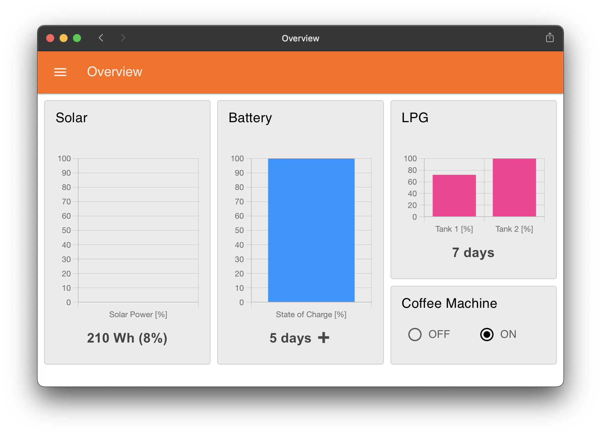
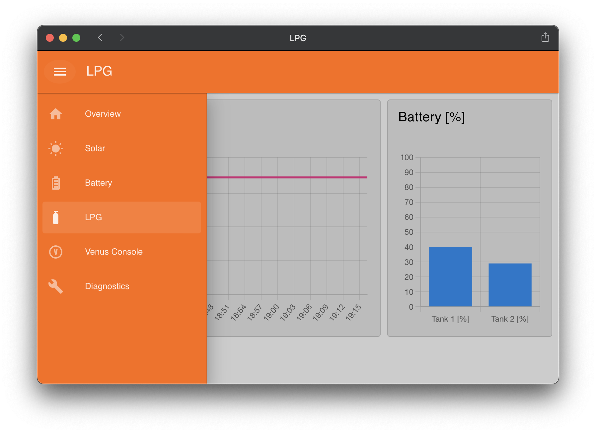
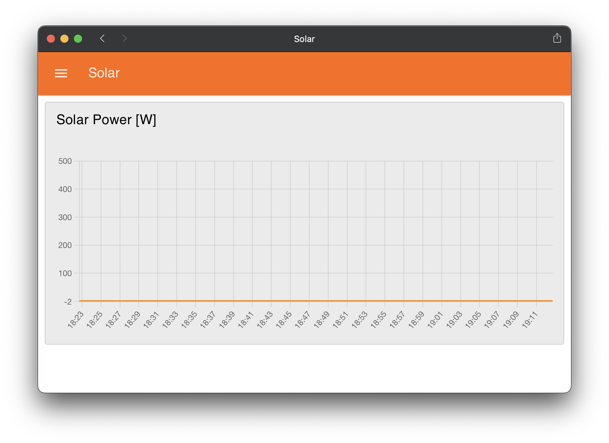
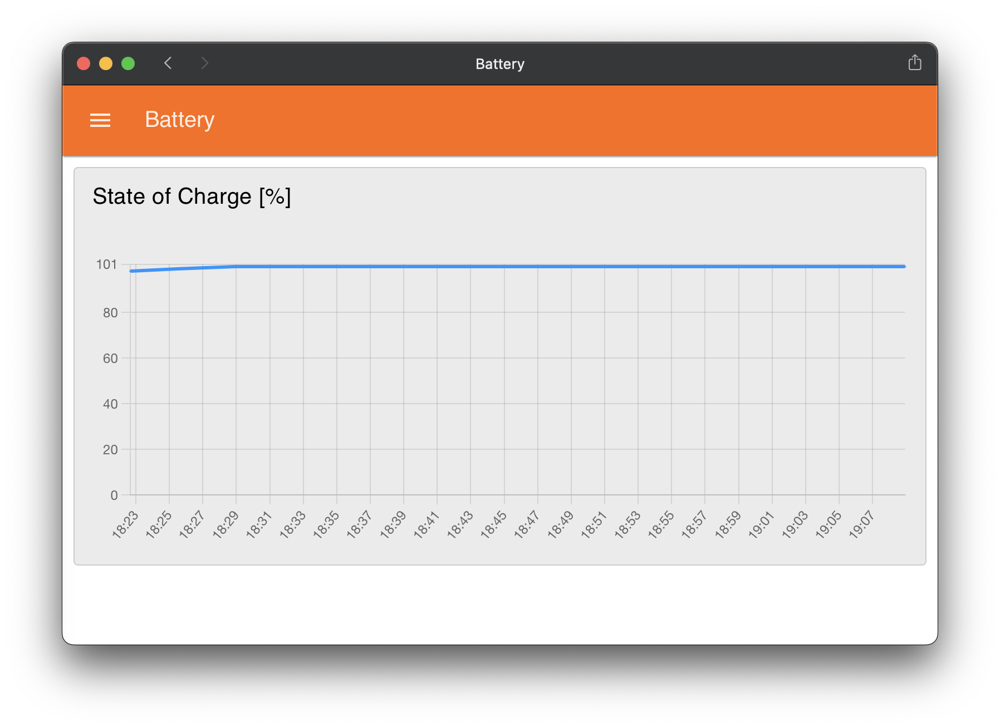
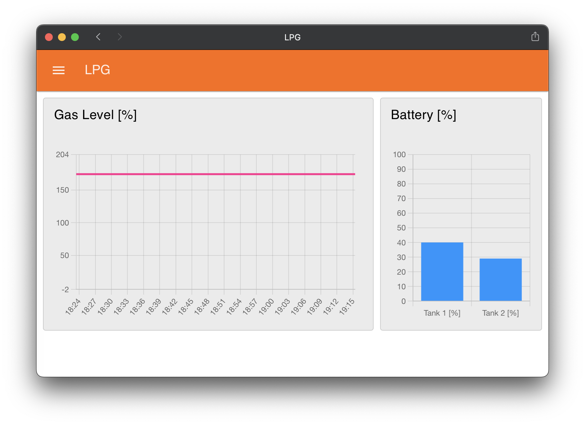
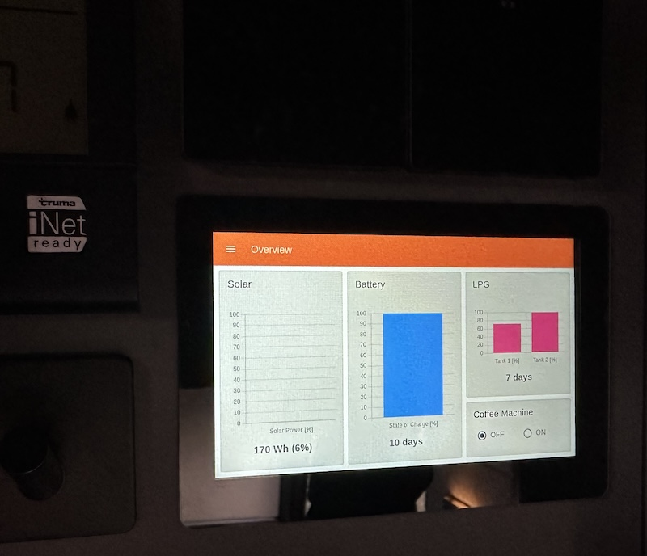

node-red-dashboard-ismove
=======================

### About

Dashboard for Niesmann Bischoff iSmove RV.

Hobby project to create a custom dashboard displaying:

- Current solar production - in percents of installed solar panel capacity.
- Daily solar yield - in Watt hours as well as in percents of installed battery capacity.
- Battery capacity and remaining time to go.
- LPG tanks capacity and remaining time to go.
- Control of Multiplus Inverter.
- Other historical and diagnostic data.

### Screenshots

### Implementation

The dashboard is runing on Raspberry Pi 4 with Waveshare 5" IPS capacitive touch display cooled down with Joy IT aluminium case.

- https://www.raspberrypi.com/products/raspberry-pi-4-model-b/
- https://www.waveshare.com/product/displays/lcd-oled/lcd-oled-1/5inch-dsi-lcd-b.htm
- https://joy-it.net/en/products/RB-AlucaseP4+07

It is implemented in Node RED (https://nodered.org) and Node Red Dashboard 2 (https://dashboard.flowfuse.com).

Monitoring and controlling of solar charger, battery, and inverter is done via https://github.com/victronenergy/node-red-contrib-victron and Cerbo GX (https://www.victronenergy.com/communication-centres/cerbo-gx).

LPG tanks are fitted with Dimex Valves (https://rotarexsrg.com/product/dimes-camping-europe-488-012-2001) that use Bluetooth LE to advertise tank level and sensor battery.

### Installation

It is neatly installed alongside Truma control panel and Niesmann Bischoff touch panels.

